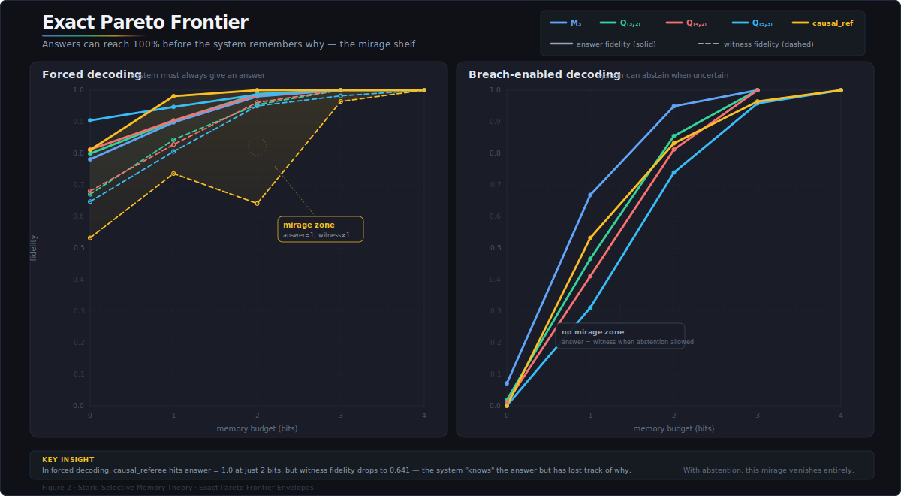
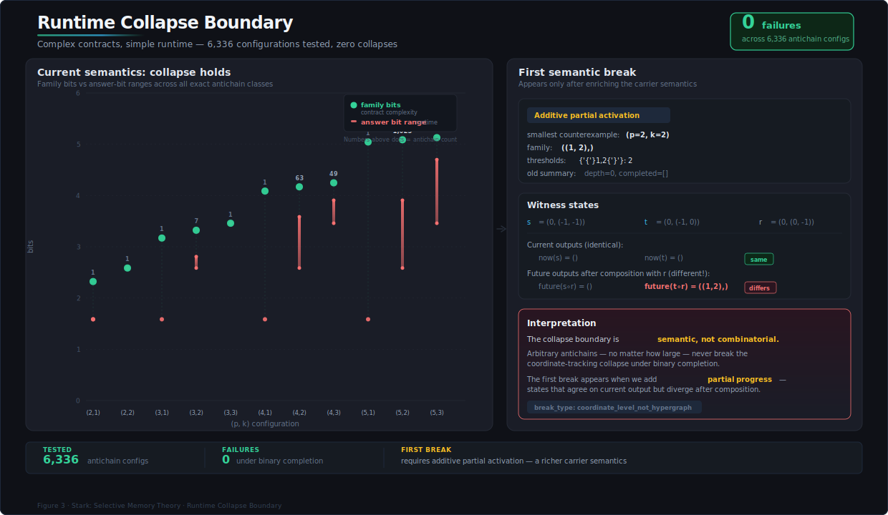
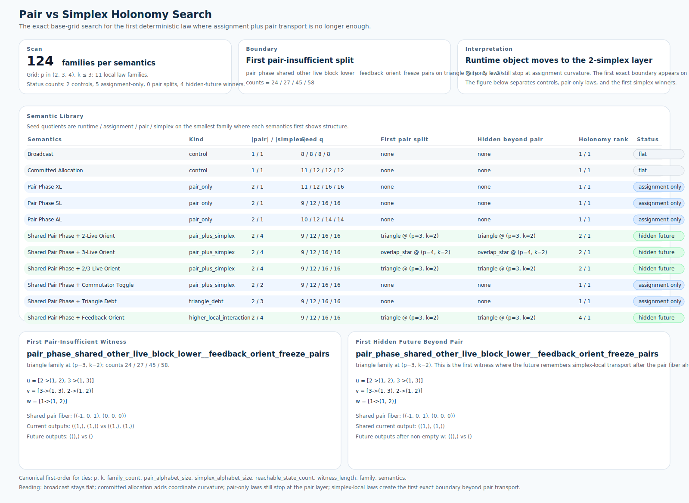
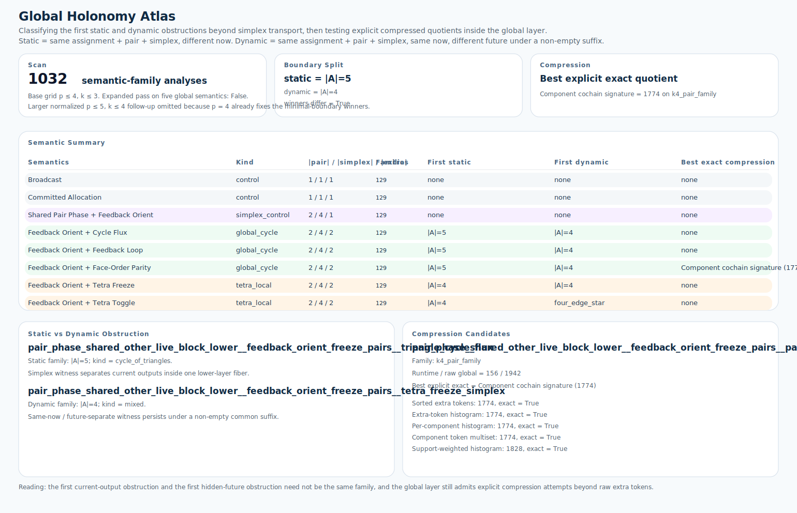

# Stark

Exact theory and exact experiments for selective memory, witness preservation, causal justification, and runtime holonomy.

This repository studies a single question from several angles:

> Under finite memory, what survives first: being right, knowing the witnesses, or preserving the full admissible family structure behind a causal claim?

The project starts from tropical threshold memory, proves that bare capacity is too coarse for causal identity, builds the protected-witness quotient, validates unique-minimal causal factorization exactly, measures the mirage shelf where answers outlive reasons, and then pushes into overlapping-family and runtime-holonomy boundaries.

Holonomy tower so far: `coordinate -> assignment -> pair -> simplex -> global`.

## Inspection Map

The repo now has one canonical, experiment-oriented layout:

- [`scripts/referee/`](scripts/referee), [`scripts/quotient-thresholds/`](scripts/quotient-thresholds), [`scripts/family-runtime/`](scripts/family-runtime), [`scripts/runtime-semantics/`](scripts/runtime-semantics), [`scripts/holonomy/`](scripts/holonomy)
- [`results/referee/`](results/referee), [`results/quotient-thresholds/`](results/quotient-thresholds), [`results/family-runtime/`](results/family-runtime), [`results/runtime-semantics/`](results/runtime-semantics), [`results/holonomy/`](results/holonomy)
- [`docs/writing/synthesis/`](docs/writing/synthesis), [`docs/writing/foundations/`](docs/writing/foundations), [`docs/writing/experiments/`](docs/writing/experiments)

Every script, report, figure, and note now lives in exactly one place.

## Start Here

If you are comfortable with ML and new to the quotient language, this is the intended path:

1. [Short overview](docs/writing/synthesis/selective-memory-master-synthesis-short.md)
2. [Master synthesis](docs/writing/synthesis/selective-memory-master-synthesis.md)
3. [Theorem and status ledger](docs/writing/synthesis/selective-memory-theorem-ledger.md)

Then use the layer-specific notes and reports as needed:

- Foundations
  - [Causal contract refinement](docs/writing/foundations/causal-contract-refinement.md)
  - [Witness-faithful factorization](docs/writing/foundations/witness-faithful-factorization.md)
  - [Contract representation theorem](docs/writing/foundations/contract-representation-theorem.md)
- Mid-layer theory and experiments
  - [Finite-probe quotient tower](docs/writing/experiments/quotient-thresholds/finite-probe-quotient-tower.md)
  - [Separator closure and family memory](docs/writing/experiments/quotient-thresholds/separator-closure-and-family-memory.md)
  - [Family-memory contract and runtime](docs/writing/experiments/family-runtime/family-memory-contract-and-runtime.md)
  - [Runtime-collapse boundary](docs/writing/experiments/family-runtime/runtime-collapse-boundary.md)
  - [Semantic boundary atlas](docs/writing/experiments/runtime-semantics/semantic-boundary-atlas.md)
- Current runtime-holonomy boundary
  - [Runtime hypergraph curvature](docs/writing/experiments/runtime-semantics/runtime-hypergraph-curvature.md)
  - [Full-assignment holonomy](docs/writing/experiments/holonomy/full-assignment-holonomy.md)
  - [Simplex-holonomy boundary](docs/writing/experiments/holonomy/simplex-holonomy-boundary.md)
  - [Global-holonomy boundary](docs/writing/experiments/holonomy/global-holonomy-boundary.md)
  - [Global-holonomy atlas](docs/writing/experiments/holonomy/global-holonomy-atlas.md)
  - [Atlas report](results/holonomy/global-holonomy-atlas/global_holonomy_atlas.md)
  - [Atlas figure](results/holonomy/global-holonomy-atlas/global_holonomy_atlas.svg)
  - [Global-quotient compression](docs/writing/experiments/holonomy/global-quotient-compression.md)
  - [Simplex-quotient compression](docs/writing/experiments/holonomy/simplex-quotient-compression.md)

## What This Repo Establishes

- Bare tropical memory preserves capacity but not witness identity.
- The exact protected-witness state count is
  `|Q_(k,p)| = sum_(d=0)^k (d + 2)^p`.
- Unique-minimal causal queries factor through the witness quotient on the scanned exact class.
- Under finite budgets, there is a real mirage shelf: answer fidelity can remain high after witness fidelity has already degraded.
- The measured system is not governed by a single quotient but by a tower:
  canonical quotient -> empirical support quotient -> probe-joint quotient -> probe-answer quotient.
- Overlapping adjustment families force a hypergraph-valued contract layer.
- Under binary completion, runtime still collapses to coordinate state on the scanned arbitrary-antichain grid.
- Changing only the readout is not enough to force genuinely non-coordinate runtime state.
- Changing the carrier does force runtime curvature.
- Pair transport is enough to break raw assignment exactness.
- Pair transport is not final: on the exact base grid, a triangle-local simplex law already breaks `assignment + pair` exactness.
- Simplex transport is not final either: on the scanned tetra/cycle-local law library, the first simplex-insufficient split appears on a 5-edge overlap family and the first hidden future beyond simplex appears on a 4-edge mixed family.
- Beyond simplex, the first static obstruction and the first dynamic hidden-future obstruction do not coincide.
- The raw global token layer is not canonical: at least one explicit global compression stays exact while shrinking the raw global quotient.

## Best Figures

These are the fastest way to see the program’s geometry.

### 1. Memory Stratigraphy

Shows the quotient tower as a measured object rather than a slogan.

### 2. Exact Pareto Frontier

Shows that the answer/witness shelf is intrinsic on the measured observational tower.

### 3. Runtime-Collapse Boundary

Shows where family contract complexity fails to enter runtime under the original binary-completion carrier.

### 4. Pair vs Simplex Holonomy Boundary

Shows the first exact base-grid boundary where pairwise transport stops being enough.

### 5. Global Holonomy Atlas

Shows that the first static global obstruction is cycle-like, while the first dynamic hidden-future obstruction is mixed/tetra-local.
Static means same lower-layer summary, different now; dynamic means same lower-layer summary, same now, different future under a non-empty suffix.

## Repo Layout

- [`docs/writing/synthesis/`](docs/writing/synthesis): the master synthesis, short overview, and theorem ledger
- [`docs/writing/foundations/`](docs/writing/foundations): the contract and factorization foundations
- [`docs/writing/experiments/`](docs/writing/experiments): layer-by-layer experiment notes and boundary statements
- [`results/referee/`](results/referee): exact referee and counterexample artifacts
- [`results/quotient-thresholds/`](results/quotient-thresholds): phase sweeps, separator closure, and Pareto frontiers
- [`results/family-runtime/`](results/family-runtime): overlapping-family and fixed-family runtime artifacts
- [`results/runtime-semantics/`](results/runtime-semantics): semantic boundary and carrier-change experiments
- [`results/holonomy/`](results/holonomy): the runtime holonomy stack from assignment to pair to simplex to global
- [`scripts/`](scripts): runnable experiment scripts grouped by layer

Most scripts follow the same pattern:

- exact finite scan or exact quotient computation
- markdown report in `results/`
- JSON companion in `results/`
- one or more SVG figures in `results/`

## Suggested Reading by Question

### “What is the main theorem-level idea?”

- [Master synthesis](docs/writing/synthesis/selective-memory-master-synthesis.md)
- [Theorem and status ledger](docs/writing/synthesis/selective-memory-theorem-ledger.md)

### “Why is bare memory not enough for causality?”

- [Causal contract refinement](docs/writing/foundations/causal-contract-refinement.md)
- [Witness-faithful factorization](docs/writing/foundations/witness-faithful-factorization.md)
- [Unique-minimal referee report](results/referee/unique-minimal-referee/unique_minimal_referee.md)

### “Where does the mirage shelf come from?”

- [Phase-transition sweep](results/quotient-thresholds/phase-transition-sweep/phase_transition_sweep.md)
- [Finite-probe quotient tower](docs/writing/experiments/quotient-thresholds/finite-probe-quotient-tower.md)
- [Exact Pareto frontier](results/quotient-thresholds/exact-pareto-frontier/exact_pareto_frontier.md)

### “Where do hypergraphs first matter?”

- [Overlapping adjustment families](results/family-runtime/overlapping-adjustment-families/overlapping_adjustment_families.md)
- [Family-memory exact search](results/family-runtime/family-memory-exact-search/family_memory_exact_search.md)
- [Runtime-collapse boundary](results/family-runtime/runtime-collapse-boundary/runtime_collapse_boundary.md)

### “What is the current open seam?”

- [Semantic boundary atlas](results/runtime-semantics/semantic-boundary-atlas/semantic_boundary_atlas.md)
- [Full-assignment holonomy search](results/holonomy/full-assignment-holonomy/full_assignment_holonomy_search.md)
- [Pair-vs-simplex holonomy search](results/holonomy/pair-vs-simplex-holonomy/pair_vs_simplex_holonomy_search.md)
- [Simplex-vs-global holonomy search](results/holonomy/simplex-vs-global-holonomy/simplex_vs_global_holonomy_search.md)
- [Global holonomy atlas](results/holonomy/global-holonomy-atlas/global_holonomy_atlas.md)

## Reproducibility

Representative scripts:

- [Unique-minimal referee script](scripts/referee/unique_minimal_referee.py)
- [Phase-transition sweep script](scripts/quotient-thresholds/phase_transition_sweep.py)
- [Separator-closure script](scripts/quotient-thresholds/separator_closure_experiment.py)
- [Exact Pareto frontier script](scripts/quotient-thresholds/exact_pareto_frontier.py)
- [Runtime-collapse boundary script](scripts/family-runtime/runtime_collapse_boundary.py)
- [Semantic boundary atlas script](scripts/runtime-semantics/semantic_boundary_atlas.py)
- [Runtime hypergraph curvature search](scripts/runtime-semantics/runtime_hypergraph_curvature_search.py)
- [Full-assignment holonomy search](scripts/holonomy/full_assignment_holonomy_search.py)
- [Pair-vs-simplex holonomy search](scripts/holonomy/pair_vs_simplex_holonomy_search.py)
- [Simplex-vs-global holonomy search](scripts/holonomy/simplex_vs_global_holonomy_search.py)
- [Global holonomy atlas](scripts/holonomy/global_holonomy_atlas.py)

Verification artifact:

- [Causal contract counterexample checker](scripts/referee/causal_contract_counterexamples.py)
- [Saved verification output](results/referee/causal-contract-counterexamples/causal_contract_counterexamples.txt)

## Current Boundary

The strongest clean statement currently supported by the repo is:

> On the fixed witness carrier, pair transport breaks raw assignment exactness; simplex transport breaks `assignment + pair` exactness; and on the scanned tetra/cycle-local law library, simplex transport itself is not final. The first simplex-insufficient split appears under a cycle-local flux law, while the first hidden future beyond simplex appears under a tetra-local freeze law.

So the next seam is now:

> Static and dynamic beyond-simplex obstructions already separate on the exact scanned set, and the raw global layer is compressible. Is the canonical runtime object a cycle/tetra local quotient on the overlap complex, or something still more global than the current token summaries?
